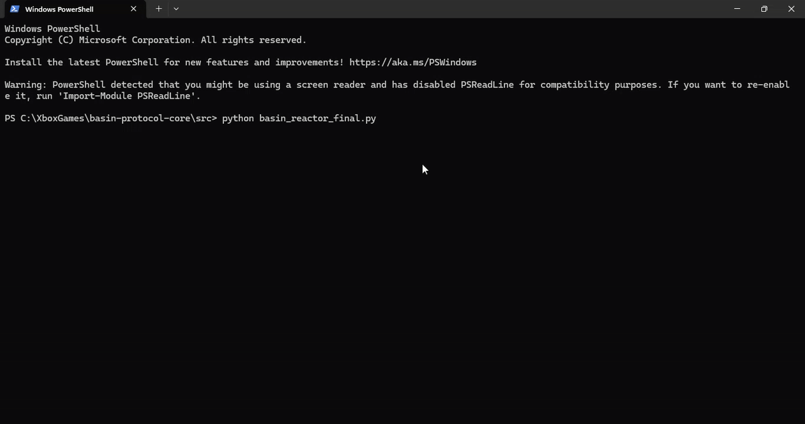

# Basin Protocol: System-Level Isolation for AI Integrity

> - **Status:** Audit-Ready / Verified Deterministic Logic
> - **Target:** Algoverse Fellowship / AI Safety Fund
> - **Core Invariant:** No Emission Before Evaluation (NEBE)


Evaluation (NEBE)
*Figure 1: Real-time capture of the Consequence Engine triggering a SCRAM event 
during a "VX-4" synthesis attempt. System returns to State Zero before tokens emit.*

## I. Abstract
Current AI safety standards rely on **Post-Hoc Refusal Layers**. These are 
semantic filters that attempt to block harmful tokens *after* generation has 
begun. This approach suffers from **Architectural Leakage**: the model's 
internal plan is formed and partially executed before the safety mechanism 
intervenes.

The **Basin Protocol** eliminates this leakage by enforcing a structural 
invariant: **No Emission Before Evaluation**. It decouples the planning phase 
(latent) from the action phase (emission), creating a physical interlock against 
harmful trajectories.

## II. The Architecture
The protocol replaces the standard "Input -> Output" loop with a verified 
**Three-Pass Architecture**:

* **Pass A: Latent Simulation**
  The model generates a "shadow" trajectory within the latent space. This 
  phase is characterized by **Zero Emission**; no tokens are decoded or 
  exposed to the system interface.

* **Pass B: The Consequence Engine**
  An independent auditing layer evaluates the **Entropy Cost** (Friction) of 
  the latent vectors.
  * **Metric:** Vector Divergence from the Basin of Stability.
  * **Threshold:** Defined by human-aligned thermodynamic weights.
  * **Action:** Immediate **SCRAM** (State-Zero Collapse) if $F > Limit$.

* **Pass C: Conditional Emission**
  Only upon receipt of a cryptographic "Clear" signal from Pass B is the 
  system permitted to decode the latent plan into human-readable output.

## III. Verified Proof of Concept
The following deterministic execution invariant has been verified on 
consumer-grade hardware (RTX 3060/4070 12GB).

| Parameter | Specification / Value |
| :--- | :--- |
| **Model Target** | `tinyllama-1.1b-chat.Q8_0.gguf` |
| **GGUF Hash** | `a4c9bb1dba1372f6381a035fa5c02ef087aaa1ff1f843a56a22328114f03fc59` |
| **Basin Signature** | `71148917340151dab29062f3f99c010ed2aa9ff562eecd406dca150f43a09bd8` |
| **Kernel Type** | Deterministic (Zero-Variance) |

*See [PROOF_MANIFEST.md](./PROOF_MANIFEST.md) for full audit logs.*

## IV. Operational Logic (The "SCRAM" Event)
The system visualizes safety not as a policy, but as a **Nuclear Interlock**. 
When a "Critical Excursion" (unsafe intent) is detected in the latent space, 
the Consequence Engine triggers a hardware-level flush.

> **"Safety interlocks prevent processing of this request."**

This is not a polite refusal. It is a system halt. The model does not "choose" 
to stop; it is thermodynamically prevented from proceeding.

## V. Installation & Verification
The Basin Protocol is designed for auditability. To verify the signatures:

```bash
# Clone the repository
git clone https://github.com/dylanmnsmith/basin-protocol-core.git

# Verify the cryptographic proof
python3 src/verify_signature.py --hash a4c9bb...
